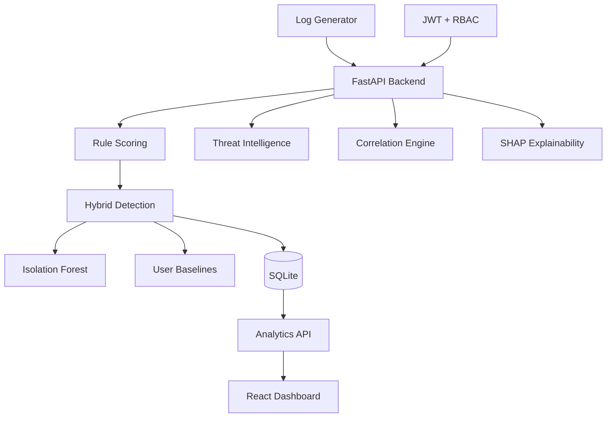

# SentinelAI — Security Log Anomaly Detection

[](https://www.python.org/downloads/)
[](https://fastapi.tiangolo.com/)
[](https://react.dev/)
[](#license)

A full-stack **Mini-SIEM** platform that ingests authentication logs, detects anomalies using hybrid rule + ML detection, correlates attack chains, enriches events with threat intelligence, and visualizes everything on a modern SOC dashboard.

---

## Project Overview

**SentinelAI** (Security Log Anomaly Detection) provides an end-to-end pipeline for collecting security events, evaluating risk, surfacing actionable alerts, and presenting analyst-ready analytics — built with FastAPI, SQLite, scikit-learn, SHAP, and React.

### Problem Statement

Security teams face overwhelming volumes of login and access logs. Manual review does not scale, and early indicators of compromise — logins from high-risk geographies, unknown devices, credential stuffing patterns — are often missed until damage is done.

### Security Use Case

| Scenario | How SentinelAI Helps |
|----------|---------------------|
| Suspicious login detection | Flags Russia/China logins and unknown devices |
| Behavioral deviation | Compares events against per-user baselines |
| Attack chain detection | Correlates multi-step patterns (stuffing, takeover, travel) |
| Threat enrichment | Matches IPs/locations against IOC feeds |
| Analyst explainability | SHAP shows why ML flagged an event |
| SOC visibility | Real-time dashboard with MITRE ATT&CK mapping |

---

## Features

| Feature | Description |
|---------|-------------|
| **Log Ingestion** | REST API (`POST /log`) with Pydantic validation |
| **Rule-Based Scoring** | Location + device risk signals |
| **Hybrid ML Detection** | Isolation Forest + behavioral baselines |
| **Alert Generation** | Auto-alerts at hybrid risk ≥ 80 with MITRE mapping |
| **Threat Intelligence** | IOC feed enrichment (JSON/CSV/mock) |
| **Correlation Engine** | 4 attack chain rules |
| **Explainable AI** | SHAP feature attribution |
| **JWT + RBAC** | ADMIN / ANALYST / VIEWER roles |
| **Investigation Workflow** | Alert triage, timeline, incident reports |
| **Real-Time Dashboard** | SentinelAI SOC UI with 5-second polling |
| **Docker Deployment** | Compose stack for backend + frontend |
| **Demo Mode** | Seeded accounts + guest access |

---

## Architecture Diagram



Detailed documentation: [docs/architecture.md](docs/architecture.md)

---

## Detection Pipeline

```
POST /log
  → Rule risk scoring (location + device)
  → Insert security_logs
  → Hybrid detection (ML + baseline + rules)
  → Advanced composite risk score
  → Alert if hybrid_risk ≥ 80 (+ MITRE mapping)
  → Correlation engine (4 rules)
  → Threat intel enrichment
  → SHAP explanation (if ML anomaly)
  → JSON response
```

Full detection logic: [docs/detection_logic.md](docs/detection_logic.md)

---

## Threat Intelligence

- **17 default IOCs** in `sample_data/threat_feed.json`
- Supports JSON, CSV, and mock fallback feeds
- Enrichment at ingestion via IP or location match
- Dashboard panel + API endpoints

| Endpoint | Purpose |
|----------|---------|
| `GET /threat-intel` | Aggregate IOC statistics |
| `GET /threat-intel/ip/{ip}` | Single IOC lookup |

Docs: [docs/phase13_threat_intelligence.md](docs/phase13_threat_intelligence.md)

---

## SIEM Correlation Engine

Detects multi-event attack chains per user:

| Rule | Pattern |
|------|---------|
| Credential Stuffing | failed → failed → success |
| Account Takeover | new device → high risk → privileged access |
| Insider Threat | ≥5 high-risk events in 24h |
| Impossible Travel | multiple locations within 2h |

Docs: [docs/phase14_correlation_engine.md](docs/phase14_correlation_engine.md)

---

## Explainable AI

- **SHAP TreeExplainer** for Isolation Forest decisions
- Top contributing features with natural-language summaries
- Fallback when model unavailable
- Dashboard panel + `GET /ml-explanation/{log_id}`

Docs: [docs/phase15_explainable_ml.md](docs/phase15_explainable_ml.md)

---

## JWT Authentication

| Endpoint | Auth | Purpose |
|----------|------|---------|
| `POST /login` | Public | JWT token generation |
| `POST /register` | ADMIN* | User registration |
| `GET /me` | Bearer / Guest | Current user profile |

*When `AUTH_REQUIRED=true`

### RBAC Roles

| Role | Access |
|------|--------|
| **ADMIN** | Full access including baselines and user management |
| **ANALYST** | Dashboard, analytics, alerts, investigation, incident reports |
| **VIEWER** | Dashboard, analytics, threat intel, correlation, explainability |

Docs: [docs/phase12_soc_features.md](docs/phase12_soc_features.md)

---

## MITRE ATT&CK Mapping

Alerts are automatically mapped to MITRE ATT&CK techniques:

| Event Pattern | Technique |
|---------------|-----------|
| Failed logins | T1110 — Brute Force |
| Successful logins | T1078 — Valid Accounts |
| Privileged access | T1078.004 — Cloud Accounts |

Visible in the Investigation panel with recommended SOC actions.

---

## API Documentation

**Base URL:** `http://127.0.0.1:8000`

| Method | Endpoint | Description |
|--------|----------|-------------|
| GET | `/` | API status |
| GET | `/health` | Health check |
| POST | `/log` | Ingest security event |
| POST | `/login` | Authenticate |
| GET | `/me` | Current user |
| GET | `/realtime-dashboard` | Live metrics |
| GET | `/analytics` | Aggregated analytics |
| GET | `/anomalies` | Anomaly statistics |
| GET | `/alerts` | Alert list |
| GET | `/threat-intel` | Threat intel summary |
| GET | `/correlation-alerts` | Correlation alerts |
| GET | `/ml-explanation/{id}` | SHAP explanation |
| GET | `/investigation/{id}` | Investigation data |
| GET | `/incident-report/{id}` | Incident report |

Interactive docs: http://127.0.0.1:8000/docs

---

## Installation

### Prerequisites

- Python 3.9+
- Node.js 18+
- npm

### Backend

```bash
git clone https://github.com/Zenara-Labs/Security-Log-Anomaly-Detection.git
cd Security-Log-Anomaly-Detection
pip install -r requirements.txt
cp .env.example .env
python3 -m uvicorn main:app --host 127.0.0.1 --port 8000 --reload
```

### Frontend

```bash
cd frontend
npm install
cp .env.example .env
npm start
```

Dashboard: http://localhost:3000

### Log Generator (Optional)

```bash
python3 log_generator.py
# Or load curated demo data:
python3 -c "
import json, requests
for e in json.load(open('sample_data/demo_logs.json')):
    p = {k:v for k,v in e.items() if k in ('user_id','event_type','location','device','source_ip') and v}
    requests.post('http://127.0.0.1:8000/log', json=p)
"
```

### ML Model Training

```bash
python3 train_model.py
```

---

## Docker Deployment

```bash
docker compose up --build
```

| Service | URL |
|---------|-----|
| Backend | http://localhost:8000 |
| Frontend | http://localhost:3000 |

Docker sets `AUTH_REQUIRED=true`. Default password: see `docker-compose.yml`.

---

## Demo Accounts

Seeded automatically on startup. Click a row on the login page to auto-fill.

| Role | Username | Password |
|------|----------|----------|
| **ADMIN** | admin | Admin123! |
| **ANALYST** | analyst1 | Analyst123! |
| **VIEWER** | viewer1 | Viewer123! |

Also available: **Continue as Guest** (temporary VIEWER session, no password).

Demo guide: [docs/demo_script.md](docs/demo_script.md)

---

## Project Structure

```
Security-Log-Anomaly-Detection/
├── app/                    # Backend application
│   ├── auth/               # JWT, RBAC, guest sessions
│   ├── core/               # Settings, security checks
│   ├── database/           # SQLite initialization
│   └── services/           # Detection, analytics, ML, TI, correlation
├── frontend/               # React SentinelAI dashboard
├── docs/                   # Architecture, phases, audits, demos
├── sample_data/            # Threat feed, demo logs, ML test data
├── tests/                  # 38 backend unit tests
├── models/                 # ML model artifacts (.gitkeep)
├── main.py                 # FastAPI entry point
├── log_generator.py        # Demo log simulator
├── train_model.py          # ML training script
├── requirements.txt
├── Dockerfile
├── docker-compose.yml
├── CHANGELOG.md
├── CONTRIBUTING.md
├── SECURITY.md
└── README.md
```

---

## Environment Variables

| Variable | Default | Description |
|----------|---------|-------------|
| `AUTH_REQUIRED` | false | Enforce JWT + RBAC |
| `JWT_SECRET_KEY` | (dev default) | JWT signing key |
| `ADMIN_USERNAME` | admin | Bootstrap admin |
| `ADMIN_PASSWORD` | Admin123! | Bootstrap password |
| `DB_NAME` | security_logs.db | SQLite file path |
| `CORS_ORIGINS` | localhost:3000 | Allowed origins |
| `REACT_APP_API_URL` | http://127.0.0.1:8000 | Frontend API URL |

See [.env.example](.env.example) for full list.

---

## Testing

```bash
python3 -m unittest discover -s tests -v   # 38 tests
cd frontend && npm test -- --watchAll=false # 1 test
```

---

## Future Enhancements

- [ ] ONNX/skops model format (replace pickle)
- [ ] Rate limiting on `POST /log`
- [ ] External threat feeds (AbuseIPDB, AlienVault OTX)
- [ ] PostgreSQL support for production scale
- [ ] E2E integration tests (Playwright)
- [ ] Email/Slack alert notifications
- [ ] Geo-velocity impossible travel detection

---

## Documentation

| Document | Description |
|----------|-------------|
| [architecture.md](docs/architecture.md) | System architecture |
| [detection_logic.md](docs/detection_logic.md) | Detection pipeline |
| [technical_report.md](docs/technical_report.md) | Technical overview |
| [ml_detection.md](docs/ml_detection.md) | ML / Isolation Forest |
| [release_v1.0.0.md](docs/release_v1.0.0.md) | Release notes |
| [final_release_audit.md](docs/final_release_audit.md) | Release audit |
| [demo_script.md](docs/demo_script.md) | Presentation script |

---

## License

This project is recommended for release under the **[MIT License](https://opensource.org/licenses/MIT)** — permissive, portfolio-friendly, and widely recognized by employers and open-source communities.

To apply: create a `LICENSE` file with the standard MIT text and your copyright year/name.

---

## Author

Built as a cybersecurity portfolio project demonstrating full-stack security engineering, ML-driven detection, and SOC platform design.

**SentinelAI** — *Detect. Correlate. Explain.*
