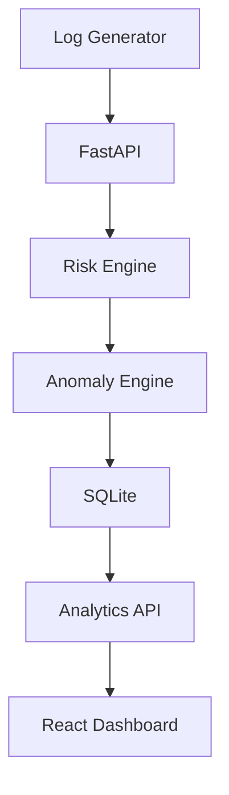
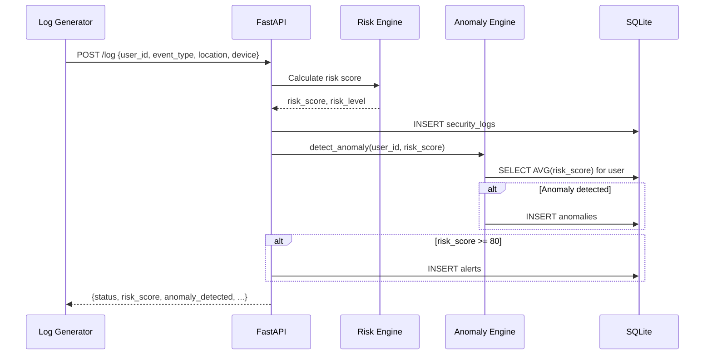
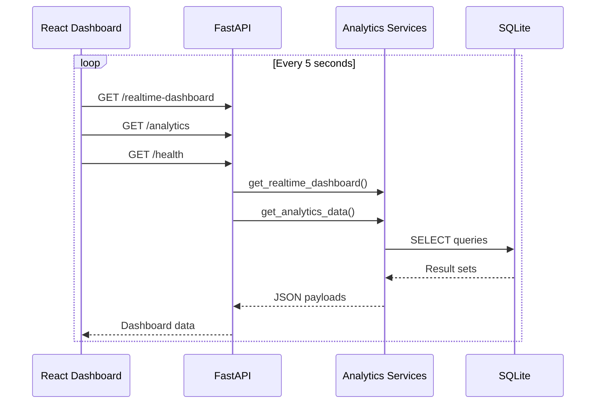
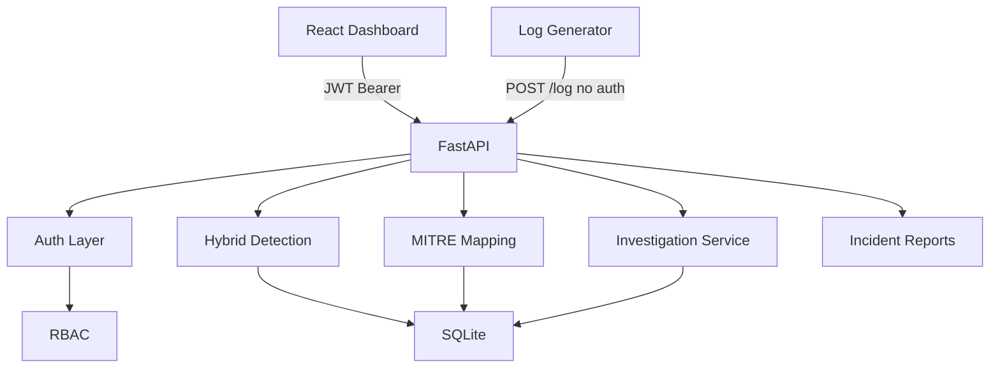
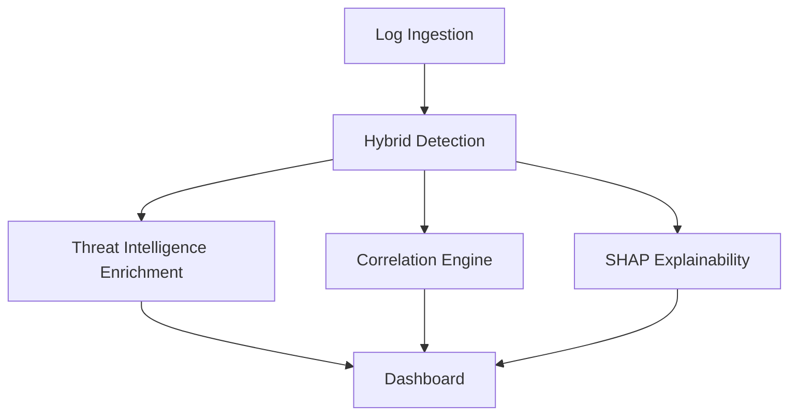

# Architecture Documentation

## High-Level Architecture

Security Log Anomaly Detection is a layered pipeline that moves security events from ingestion through scoring, detection, persistence, and visualization. Each layer has a single responsibility and communicates through well-defined interfaces.



The system follows a **unidirectional data flow**: events enter at the top, are processed and stored in the middle, and are consumed by analytics and visualization at the bottom. There is no write path from the dashboard back to the database — the frontend is read-only.

---

## Component Descriptions

### Log Generator

**File:** `log_generator.py`

A standalone Python script that simulates real-world security events by POSTing random login payloads to the FastAPI ingestion endpoint every 2 seconds. Used for development, demos, and end-to-end testing.

| Attribute | Detail |
|-----------|--------|
| Input | Randomized user, location, device combinations |
| Output | HTTP POST to `/log` |
| Dependencies | `requests`, `python-dotenv` |

---

### FastAPI Application

**File:** `main.py`

The central API gateway. Handles HTTP routing, request validation (Pydantic), CORS, structured logging, error handling, and orchestrates the ingestion pipeline.

| Endpoint | Handler | Purpose |
|----------|---------|---------|
| `GET /` | `root()` | API status |
| `GET /health` | `health_check()` | DB connectivity probe |
| `POST /log` | `create_log()` | Event ingestion pipeline |
| `GET /realtime-dashboard` | `realtime_dashboard()` | Live metrics |
| `GET /analytics` | `analytics()` | Aggregated analytics |
| `GET /anomalies` | `anomalies()` | Anomaly statistics |

On startup, `initialize_database()` ensures all SQLite tables exist.

---

### Risk Engine

**Location:** Inline in `main.py` (`create_log`)

A rule-based scoring engine that evaluates each incoming event against known risk signals.

```
Base score: 20
+ 40 if location ∈ {Russia, China}
+ 40 if device = "Unknown Device"
→ risk_score (max 100)
→ risk_level: LOW | MEDIUM | HIGH
```

The engine also sets `anomaly_status` on the log record (`NORMAL` if score < 50, `ANOMALY` otherwise) and triggers alert generation when score ≥ 80.

---

### Anomaly Engine

**File:** `app/services/anomaly_service.py`

A behavioral analysis module that compares the current event against the user's historical profile.

| Rule | Trigger | Output |
|------|---------|--------|
| High Risk Spike | `risk_score >= 90` | `anomaly_type: "High Risk Spike"`, score 0.95 |
| Behavior Deviation | `risk_score > 1.5 × AVG(historical)` | `anomaly_type: "Behavior Deviation"`, score 0.85 |

When an anomaly is detected, a record is inserted into the `anomalies` table. The function returns detection metadata to the ingestion response.

---

### SQLite Database

**File:** `app/database/database.py`

Embedded relational storage with three tables:

| Table | Purpose | Key Columns |
|-------|---------|-------------|
| `security_logs` | All ingested events | `user_id`, `risk_score`, `anomaly_status`, `timestamp` |
| `alerts` | HIGH-severity alerts | `user_id`, `severity`, `description` |
| `anomalies` | Detected anomalies | `user_id`, `anomaly_type`, `anomaly_score` |

The module also includes legacy schema migration (renaming `user_name` → `user_id` if an old database is detected).

Configuration is driven by `app/core/settings.py` with the `DB_NAME` environment variable.

---

### Analytics API

**Files:**
- `app/services/analytics_service.py`
- `app/services/realtime_dashboard_service.py`
- `app/services/anomaly_service.py` (`get_anomaly_stats`)

Read-only query layer that aggregates stored data for the dashboard.

| Service | Returns |
|---------|---------|
| `get_analytics_data()` | Average risk, most targeted user, top-5 users, alert count, anomaly stats |
| `get_realtime_dashboard()` | Total/high/medium/low counts, latest 10 events |
| `get_anomaly_stats()` | Total anomalies, breakdown by type, 10 most recent |

---

### React Dashboard (SentinelAI)

**Directory:** `frontend/src/`

A modular SOC-style dashboard that polls the backend every 5 seconds.

| Component | Data Source | Purpose |
|-----------|-------------|---------|
| `useDashboardData` hook | `/realtime-dashboard`, `/analytics`, `/health` | Central data fetching |
| `MetricCard` | Analytics + dashboard | Executive KPIs |
| `RiskDonutChart` | Dashboard + anomaly stats | Risk distribution |
| `LiveSecurityFeed` | `latest_events` | Real-time event stream |
| `AnomalyCenter` | `anomaly_stats` | Investigation panel |
| `AlertPanel` | High-risk events + alert count | Alert triage |
| `AIInsightsWidget` | Derived from analytics | Threat recommendations |

The dashboard uses a collapsible sidebar for navigation across six views: Dashboard, Analytics, Threats, Anomalies, Alerts, and Settings.

---

## Data Flow

### 1. Log Ingestion Flow



### 2. Dashboard Read Flow



---

## Configuration Layer

**File:** `app/core/settings.py`

Centralized configuration loaded from environment variables via `python-dotenv`:

| Setting | Env Variable | Default |
|---------|-------------|---------|
| Project name | `PROJECT_NAME` | Security Log Anomaly Detection System |
| API version | `API_VERSION` | 1.0.0 |
| Database file | `DB_NAME` | security_logs.db |
| Log level | `LOG_LEVEL` | INFO |
| CORS origins | `CORS_ORIGINS` | * |

---

## Deployment Topology

```
┌─────────────────────────────────────────────────┐
│                  Developer Machine               │
│                                                  │
│  ┌──────────────┐    ┌───────────────────────┐  │
│  │ log_generator │───▶│  FastAPI (:8000)      │  │
│  └──────────────┘    │  ├── Risk Engine       │  │
│                       │  ├── Anomaly Engine    │  │
│                       │  └── SQLite (.db)     │  │
│                       └──────────┬────────────┘  │
│                                  │ HTTP           │
│                       ┌──────────▼────────────┐  │
│                       │  React Dev (:3000)     │  │
│                       │  SentinelAI Dashboard  │  │
│                       └───────────────────────┘  │
└─────────────────────────────────────────────────┘
```

A `Dockerfile` is included for containerized backend deployment. The frontend builds to static files via `npm run build` and can be served by any static file server.

---

## Phase 12 — SOC Platform Architecture

Phase 12 adds enterprise SOC capabilities on top of the existing hybrid detection pipeline without modifying ML models or breaking API response schemas.



### Authentication Endpoints

| Endpoint | Auth | Purpose |
|----------|------|---------|
| `POST /login` | Public | JWT token generation |
| `POST /register` | ADMIN (when AUTH_REQUIRED) | User registration |
| `GET /me` | Bearer | Current user profile |

### RBAC Roles

| Role | Permissions |
|------|-------------|
| ADMIN | All endpoints including baselines and user registration |
| ANALYST | Dashboard, analytics, anomalies, alerts, investigation, incident reports |
| VIEWER | Read-only dashboard |

### New SOC Endpoints

| Endpoint | Purpose |
|----------|---------|
| `GET /alerts` | List alerts with MITRE mapping |
| `GET /investigation/{alert_id}` | Full investigation workbench data |
| `GET /incident-report/{alert_id}` | JSON incident report export |

### Backward Compatibility

- `POST /log` remains **public** (log generator compatibility)
- `GET /health` and `GET /` remain **public**
- All existing response fields preserved; new fields are additive
- `AUTH_REQUIRED=false` (default) bypasses RBAC for local development
- `AUTH_REQUIRED=true` (Docker default) enforces JWT + RBAC

### Risk Score Fields (Phase 12.1)

| Field | Scope | Description |
|-------|-------|-------------|
| `rule_risk_score` | API + DB | Rule-engine score only (location/device rules) |
| `hybrid_risk_score` | API + DB | Composite score (rule + ML + baseline) |
| `risk_score` (API response) | API | **Rule score** — backward compatible with pre-Phase-11 clients |
| `risk_score` (DB column) | DB | **Hybrid score** — legacy column; use `hybrid_risk_score` explicitly |
| `average_risk` (analytics) | API | Hybrid average (unchanged for clients) |
| `average_rule_risk` | API | New — rule-engine average |
| `average_hybrid_risk` | API | New — explicit hybrid average |

See [docs/phase12_soc_features.md](phase12_soc_features.md) for full documentation.

---

## Phase 13–15 — Mini-SIEM Platform



| Phase | Service | Endpoints |
|-------|---------|-----------|
| 13 | `threat_intelligence_service.py` | `GET /threat-intel`, `GET /threat-intel/ip/{ip}` |
| 14 | `correlation_engine.py` | `GET /correlation-alerts`, `GET /correlation-alerts/{id}` |
| 15 | `explainable_ml_service.py` | `GET /ml-explanation/{log_id}` |

See [phase13_threat_intelligence.md](phase13_threat_intelligence.md), [phase14_correlation_engine.md](phase14_correlation_engine.md), [phase15_explainable_ml.md](phase15_explainable_ml.md).

---

## Error Handling Strategy

| Layer | Strategy |
|-------|----------|
| FastAPI routes | Try/except with `HTTPException` (500/503) |
| Database | Connection per request, explicit commit/close |
| Frontend | Error screen with retry, toast notifications |
| Log Generator | HTTP status check, non-JSON detection, connection errors |

---

## Security Considerations

- JWT authentication with role-based access control (Phase 12)
- `AUTH_REQUIRED` env flag — set `true` in production/Docker
- CORS configurable via environment variable
- Password hashing via bcrypt
- `POST /log` intentionally public for log ingestion pipelines
- Input validation via Pydantic (`min_length`/`max_length` on all log fields)
- SQLite file stored locally (`security_logs.db`, gitignored)
- Secrets via `.env` — JWT_SECRET_KEY must be changed in production

---

## Related Documentation

- [README.md](../README.md) — Project overview, API reference, installation
- [FastAPI Interactive Docs](http://127.0.0.1:8000/docs) — Auto-generated OpenAPI documentation (when server is running)
