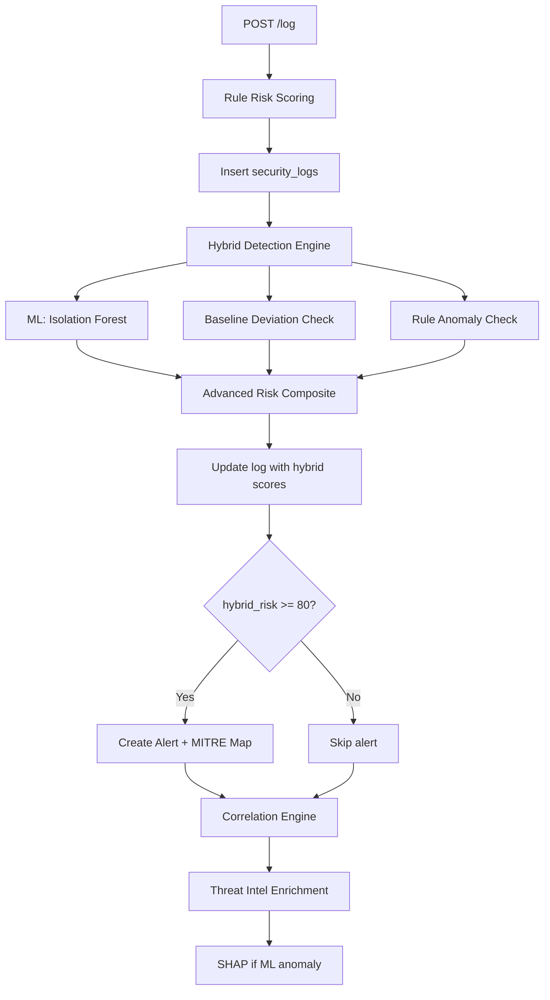

# Detection Logic

This document describes how SentinelAI detects suspicious activity across rule-based scoring, hybrid ML, baselines, correlation, and threat intelligence enrichment.

For ML-specific details, see [ml_detection.md](ml_detection.md).

---

## Detection Pipeline Overview

---

## Layer 1: Rule-Based Risk Scoring

**Location:** `main.py` → `create_log()`

Every event starts with a base score of **20**.

| Signal | Condition | Points |
|--------|-----------|--------|
| High-risk location | `Russia` or `China` | +40 |
| Unknown device | `Unknown Device` | +40 |

**Maximum rule score:** 100

| Score Range | Level | `anomaly_status` |
|-------------|-------|------------------|
| 0–49 | LOW | NORMAL |
| 50–79 | MEDIUM | ANOMALY |
| 80–100 | HIGH | ANOMALY |

---

## Layer 2: Hybrid Detection Engine

**Location:** `app/services/hybrid_detection_service.py`

Combines three independent signals. An event is flagged if **any** layer detects suspicious activity.

| Layer | Service | Trigger |
|-------|---------|---------|
| Rule anomaly | Inline rules | High-risk location/device combinations |
| ML anomaly | `ml_anomaly_service.py` | Isolation Forest outlier score |
| Baseline deviation | `baseline_service.py` | Deviation from user's normal profile |

**Confidence** is computed from layer contributions and clamped to `[0, 1]`.

---

## Layer 3: User Behavior Baselines

**Location:** `app/services/baseline_service.py`

Per-user profiles track:

- `typical_device`
- `typical_ip` (location)
- `normal_login_hour`
- `typical_event_frequency`

**Deviation checks (before baseline update):**

| Check | Threshold |
|-------|-----------|
| Login hour | ±4 hours from normal |
| New device | Device differs from typical |
| New location | Location differs from typical |
| Frequency spike | Exceeds 3× typical frequency |

---

## Layer 4: Advanced Risk Composite

**Location:** `app/services/advanced_risk_service.py`

Combines rule score, ML score, and baseline deviation into `hybrid_risk_score` with risk level classification (LOW / MEDIUM / HIGH / CRITICAL).

Alerts are generated when `hybrid_risk_score >= 80`.

---

## Layer 5: Legacy Anomaly Rules

**Location:** `app/services/anomaly_service.py`

| Rule | Condition | Type | Score |
|------|-----------|------|-------|
| High Risk Spike | `risk_score >= 90` | High Risk Spike | 0.95 |
| Behavior Deviation | `risk_score > 1.5 × user average` | Behavior Deviation | 0.85 |

Results stored in `anomalies` table and included in analytics.

---

## Layer 6: SIEM Correlation Engine

**Location:** `app/services/correlation_engine.py`

Runs after each log ingestion, scoped per `user_id`.

| Rule | Pattern | Window |
|------|---------|--------|
| Credential Stuffing | failed → failed → success login | 2 hours |
| Account Takeover | new device → high risk → privileged access | 4 hours (requires baseline) |
| Insider Threat | ≥5 high-risk events | 24 hours |
| Impossible Travel | ≥2 locations | 2 hours |

Duplicate alerts suppressed within 1 hour per rule+user.

---

## Layer 7: Threat Intelligence Enrichment

**Location:** `app/services/threat_intelligence_service.py`

Matches `source_ip` or `location` against IOC feed at ingestion time. Returns threat score, category, confidence, and human-readable context.

Does not modify risk score — enrichment is additive in API response.

---

## Layer 8: Explainable AI

**Location:** `app/services/explainable_ml_service.py`

When ML flags an anomaly, SHAP TreeExplainer attributes the decision to features:

- `login_hour`
- `elevated_risk_count`
- `event_frequency`
- `risk_score`

Falls back to deviation-based explanation if model unavailable.

---

## API Response Fields (POST /log)

| Field | Description |
|-------|-------------|
| `risk_score` | Rule score (backward compatible) |
| `rule_risk_score` | Explicit rule score |
| `hybrid_risk_score` | Composite score |
| `ml_anomaly` | ML layer flag |
| `baseline_deviation` | Baseline layer flag |
| `confidence` | Hybrid engine confidence |
| `threat_intel` | IOC match (if any) |
| `ml_explanation` | SHAP summary (if ML anomaly) |

---

## Related Documentation

- [architecture.md](architecture.md) — System design
- [ml_detection.md](ml_detection.md) — Isolation Forest details
- [phase14_correlation_engine.md](phase14_correlation_engine.md) — Correlation rules
- [phase13_threat_intelligence.md](phase13_threat_intelligence.md) — Threat feeds
- [phase15_explainable_ml.md](phase15_explainable_ml.md) — SHAP explainability
