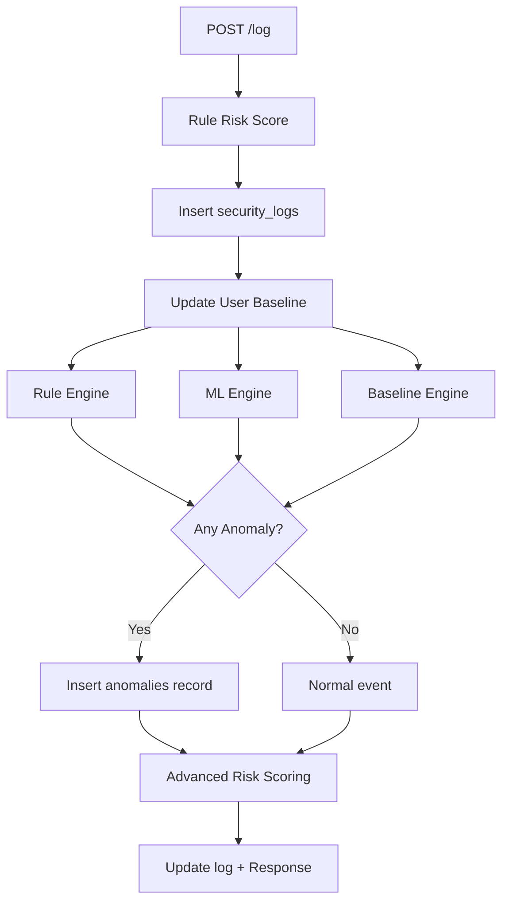

# ML Detection Documentation

## Overview

Phase 11 introduces a **Hybrid Rule + Machine Learning** detection engine to the Security Log Anomaly Detection platform. The system combines three detection layers:

1. **Rule-Based Detection** — threshold and historical average rules (Phase 9)
2. **Isolation Forest ML** — unsupervised outlier detection on behavioral features
3. **User Behavior Baseline** — per-user profile deviation analysis

An event is flagged as an anomaly if **any** layer detects suspicious activity.

---

## Isolation Forest

Isolation Forest is an unsupervised anomaly detection algorithm that isolates observations by randomly selecting features and split values. Anomalies require fewer splits to isolate, yielding shorter path lengths in the tree ensemble.

### Why Isolation Forest?

- Works well with small-to-medium datasets
- No labeled training data required
- Efficient for real-time scoring
- Handles multi-dimensional behavioral features

### Model Configuration

| Parameter | Value |
|-----------|-------|
| Algorithm | `sklearn.ensemble.IsolationForest` |
| `n_estimators` | 100 |
| `contamination` | Dynamic (0.05–0.2 based on dataset size) |
| `random_state` | 42 |
| Model file | `models/isolation_forest.pkl` |

---

## Feature Engineering

Each log event is converted into a 4-dimensional feature vector:

| Feature | Source | Description |
|---------|--------|-------------|
| `login_hour` | Event timestamp | Hour of day (0–23) |
| `failed_login_count` | Derived | Count of user's events with risk ≥ 50 |
| `event_frequency` | Derived | User's events in the last hour |
| `risk_score` | Risk engine | Rule-based risk score (0–100) |

Features are extracted at inference time from the SQLite `security_logs` table.

### Small Dataset Handling

- Minimum **10 records** required for training
- If insufficient data: ML detection returns `model_ready: false` and gracefully skips
- Model auto-trains on startup when enough historical data exists
- Manual training via `python3 train_model.py`

---

## Training Process

```bash
# 1. Generate training data
python3 log_generator.py

# 2. Train the model
python3 train_model.py

# 3. Verify model exists
ls models/isolation_forest.pkl
```

### Training Pipeline

1. Load all records from `security_logs`
2. Extract 4-feature vectors per record
3. Fit Isolation Forest with dynamic contamination
4. Serialize model to `models/isolation_forest.pkl`

---

## Hybrid Detection Workflow



### Hybrid Logic

```
IF rule_anomaly OR ml_anomaly OR baseline_deviation
THEN anomaly = TRUE
```

### Confidence Calculation

| Signal | Weight |
|--------|--------|
| Rule anomaly | 45% |
| ML anomaly | 35% |
| Baseline deviation | 20% |

---

## Advanced Risk Scoring

Final risk score combines all detection layers:

```
Final Risk = Rule Score + (ML Score × 20) + Deviation Score
```

Capped at 100.

| Final Score | Classification |
|-------------|----------------|
| 0 – 49 | LOW |
| 50 – 79 | MEDIUM |
| 80 – 89 | HIGH |
| 90 – 100 | CRITICAL |

---

## API Endpoints

### `GET /ml-anomalies`

Returns ML-specific anomaly statistics.

### `GET /user-baselines`

Returns per-user behavioral baselines.

Existing endpoints (`POST /log`, `GET /analytics`, `GET /anomalies`) remain backward compatible with extended response fields.

---

## Database Schema (Phase 11 Additions)

### New Table: `user_baselines`

| Column | Type | Description |
|--------|------|-------------|
| `user_id` | TEXT | Unique user identifier |
| `normal_login_hour` | INTEGER | Average login hour |
| `typical_ip` | TEXT | Most common location |
| `typical_device` | TEXT | Most common device |
| `typical_event_frequency` | INTEGER | Events per 24h |

### New Columns (migration-safe)

Added to `security_logs` and `anomalies`:

- `ml_anomaly` (INTEGER)
- `ml_score` (REAL)
- `baseline_deviation` (INTEGER)
- `confidence_score` (REAL)
- `login_hour` (INTEGER, security_logs only)
- `rule_risk_score` (INTEGER, security_logs only)

---

## Limitations

- **Small datasets** — ML model requires ≥ 10 records; performance improves with volume
- **Location as IP proxy** — `typical_ip` uses login location since IP is not in the schema
- **No online learning** — model must be retrained manually via `train_model.py`
- **Single-model architecture** — only Isolation Forest; no ensemble yet
- **Feature scope** — 4 features; no network-level or session-level features

---

## Future Improvements

- **Online model retraining** — automatic periodic retraining on new data
- **Feature expansion** — IP address, session duration, geo-velocity
- **Model ensemble** — combine Isolation Forest with Local Outlier Factor
- **Labeled feedback loop** — analyst confirmations to improve detection
- **MITRE ATT&CK mapping** — classify ML anomalies by attack technique
- **Model versioning** — track and compare model performance over time
- **GPU acceleration** — for large-scale log processing
